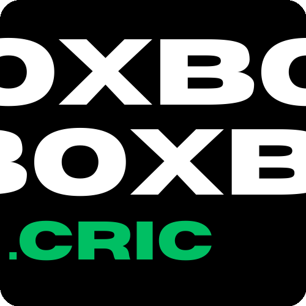

<p align="center">
  
</p>

<p align="center">
  <em>Live scores, deep match insights, and fantasy tools — all in a fast, dark-themed PWA you can install on your phone.</em>
</p>

<p align="center">
  <a href="https://theboxcric.web.app">
    
  </a>
</p>

---

## What It Does

### Live Matches
- Real-time scores with auto-polling every 10 seconds
- Ball-by-ball commentary via wallstream
- Win probability bar that updates as the match progresses
- AI-generated match summaries

### Match Insights
When you open a live or completed match, you get a full breakdown:
- **Wagon Wheel** — shot placement map per innings
- **Worm Chart** — run-rate comparison between innings
- **Manhattan Chart** — over-by-over scoring patterns
- **Partnerships** — visual partnership breakdown
- **Batsman vs Bowler Matchups** — head-to-head performance data
- **Win Probability** — calculated in real time based on match situation, format, and phase

### Upcoming Matches
- Fixtures with countdown timers
- Head-to-head records between teams
- Recent form for both sides
- Venue stats and pitch conditions
- Weather information
- Squad previews

### Completed Matches
- Full scorecards with batting, bowling, and fall-of-wickets data
- Browse past results by date range
- Series-level grouping

### Series & Tournament Hubs
- Points tables for multi-team tournaments
- All matches in a series grouped together
- Automatic detection of bilateral vs tournament format

### Fantasy Tools
- **Dream11 Predictor** — fantasy point predictions for upcoming matches
- **Play Mode** — build your own fantasy team with a team builder, live scoring, and contest system
- Firebase authentication for user profiles and team persistence

### Installable PWA
- Works offline for cached content
- Add to home screen on iOS and Android
- Service worker with network-first strategy

---

## Design

Dark theme throughout, built for readability during night sessions. Key choices:

- **Typography**: Outfit for body text, JetBrains Mono for scores and stats, Zen Dots and BBH Bartle for branding elements
- **Color system**: High-contrast dark palette (`#0f0f0f` base) with team-specific accent colors pulled dynamically for match cards, headers, and probability bars
- **Cards**: Glassmorphism-style cards with subtle backdrop blur and team-color radial gradients as watermarks
- **Animations**: Shimmer loading skeletons, pulsing live indicators, smooth probability bar transitions
- **Layout**: Mobile-first, single-column feed with horizontal scroll carousels for featured matches. Stack-based navigation with overlay transitions

Team logos are sourced from Wikipedia and rendered inline. Match cards use each team's brand color for tinted backgrounds.

---

## Tech Stack

| Layer | Tech |
|-------|------|
| Frontend | React 19, TypeScript |
| Styling | Tailwind CSS 4 |
| Bundler | Parcel |
| Hosting | Firebase Hosting |
| API Proxy | Cloudflare Worker (`cricket-proxy`) |
| Database | Supabase (user profiles, contests, fantasy data) |
| Auth | Firebase Authentication |
| Data Source | Wisden APIs (matches, scorecards, ball-by-ball) |

---

## Project Structure

```
boxcric/
├── src/
│   ├── components/        # React components
│   │   ├── insights/      # Wagon wheel, worm, manhattan, matchups, conditions
│   │   ├── upcoming/      # H2H, venue, squad, recent form, time filters
│   │   ├── play/          # Fantasy team builder, contests, game dashboard
│   │   ├── dream11/       # Dream11 predictions and playground
│   │   └── completed/     # Past match list
│   ├── utils/             # API clients, data hooks, win probability engine
│   ├── styles/            # CSS modules (base, cards, layout, tournament)
│   ├── data/              # Static data (AI summaries, league metadata, audio)
│   └── sw.js              # Service worker
├── cricket-proxy/         # Cloudflare Worker (CORS proxy + Supabase relay)
├── supabase/              # Database migrations and schema
├── scripts/               # Build and utility scripts
└── firebase.json          # Hosting configuration
```

---

## Getting Started

```bash
# Clone
git clone https://github.com/ashwkun/boxcric.git
cd boxcric

# Install
npm install

# Set up environment
cp .env.example .env
# Fill in Firebase and Supabase credentials

# Run locally
npm start
```

### Scripts

| Command | What it does |
|---------|-------------|
| `npm start` | Dev server via Parcel |
| `npm run build` | Production build to `dist/` |
| `npm run ship` | Build → deploy to Firebase → commit and push |

---

## Contributing

See [CONTRIBUTING.md](./CONTRIBUTING.md) for setup instructions, branch workflow, and deployment guide.

---

## License

ISC
